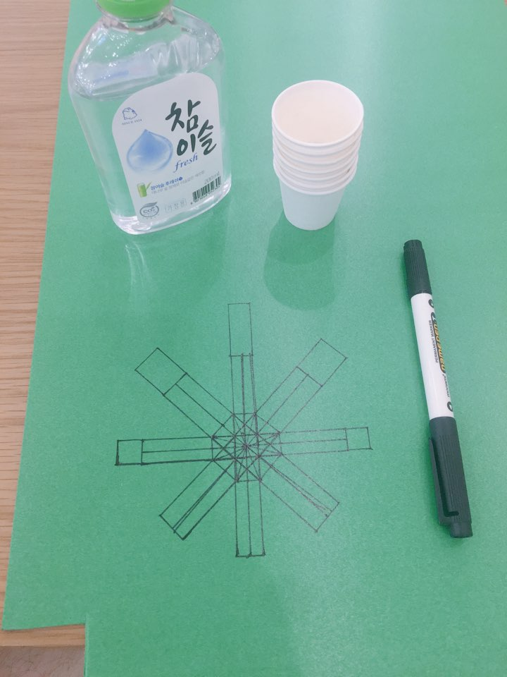
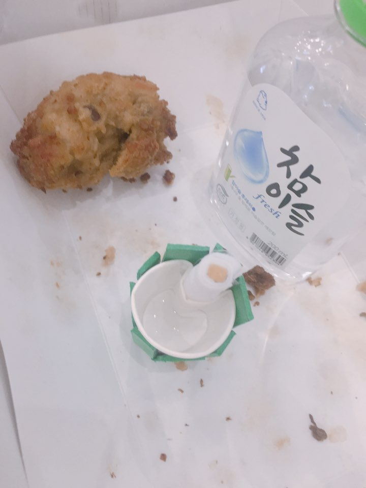

## 금주잔 - 술 냄새 나는 물컵

과일향 물컵으로 Indiegogo 1M 펀딩사례 있었음 (평은 안좋음)

- [The Right Cup](https://namu.wiki/w/The%20Right%20Cup)

## 시도

1.  컵 테두리에 휴지 붙여 적시기
2.  스프레이에 술 담아 뿌리기
3.  자동차 방향제에 술 담아 컵에 꽂기
4.  마스크에 술 뭍히고 입 부분만 구멍 뚫기 (시도하지 않음)

가장 단순한 1 이 효과가 제일 좋았다.

## 결과물

## 사용법

1.  심지를 술에 적신 후 꽂는다.
2.  물을 따라 마시면서 심지의 냄새를 맡는다.
